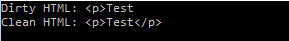

# TidyHtml5Managed
This is a managed .NET wrapper for the open source, cross-platform [Tidy HTML5](http://www.html-tidy.org/) library.

TidyHtml5Managed was forked from Mark Beaton's [TidyManaged](https://github.com/markbeaton/TidyManaged), with the main objectives are to implement
the new features of Tidy HTML5 and drop support for the old Tidy library.

Minimum version of the supported Tidy HTML5 library is [5.0.0](https://github.com/htacg/tidy-html5/releases/tag/5.0.0)

## Usage
### From Binary
1. Create your new application project
2. Get **TidyHtml5Managed.dll** from [release page](https://github.com/frandi/TidyHtml5Managed/releases) 
(or go [build yourself](BUILD.md)), and add reference to it from your application project
3. Get **tidy.dll** from [release page](http://binaries.html-tidy.org/) 
(or go [build yourself](https://github.com/htacg/tidy-html5/blob/master/README/README.md)), and put it in your application project's output folder
4. Build and Run your project

### From NuGet
1. Create your new application project
2. Install TidyHtml5Managed package from NuGet

    '''
    Install-Package TidyHtml5Managed
    '''

3. Build and Run your project

### Code Sample

The following code is the sample of using the library in a Console Application.

    '''c#
    using System;
    using TidyManaged;
    
    namespace TidyHtml5.ConsoleApp
    {
        class Program
        {
            static void Main(string[] args)
            {
                string dirtyHtml = "
Test";
                Console.WriteLine("Dirty HTML: " + dirtyHtml);
    
                using (Document doc = Document.FromString(dirtyHtml))
                {
                    doc.OutputBodyOnly = AutoBool.Yes;
                    doc.Quiet = true;
                    doc.CleanAndRepair();
                    string cleanHtml = doc.Save();
    
                    Console.WriteLine("Clean HTML: " + cleanHtml);
                }
    
                Console.ReadKey();
            }
        }
    }
    '''

And here is the output:

## License
TidyHtml5Managed uses MIT License as stated in the [License](LICENSE.md) file.